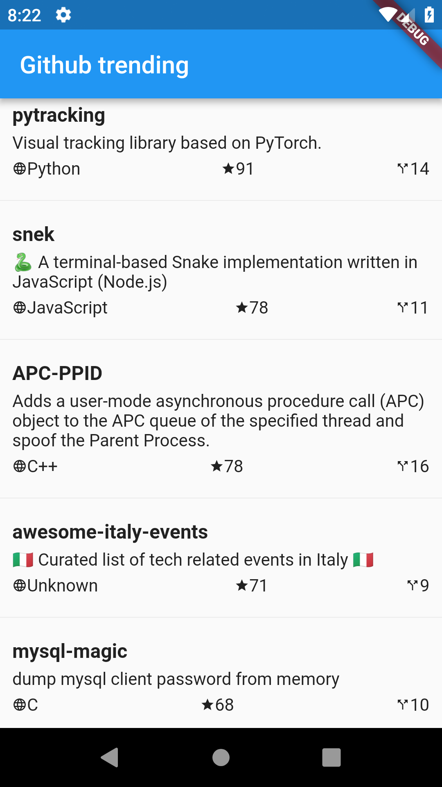

# Github Trending App

Github Trending app built with [Flutter](https://github.com/flutter)



## Build

Clone code to local

```
git clone git@github.com:huangyanxiong01/Github-Trending-App.git
```

Get packages from dart pub site

```
flutter packages get
```

Serializing JSON using code generation libraries

```
flutter packages pub run build_runner build
```

Run app

```
flutter run
```

## Learn
- How build layout in flutter
- How read data from Remote Api
- How auto serializing JSON